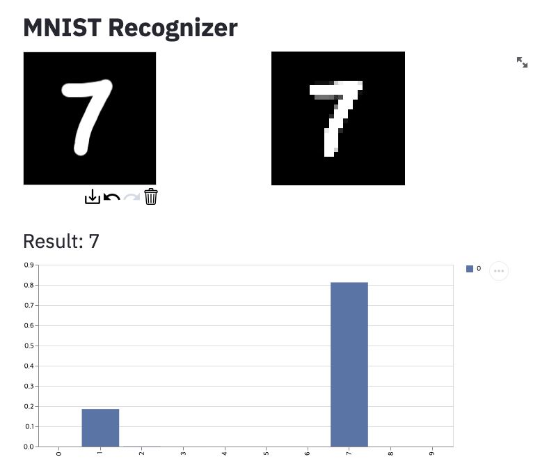
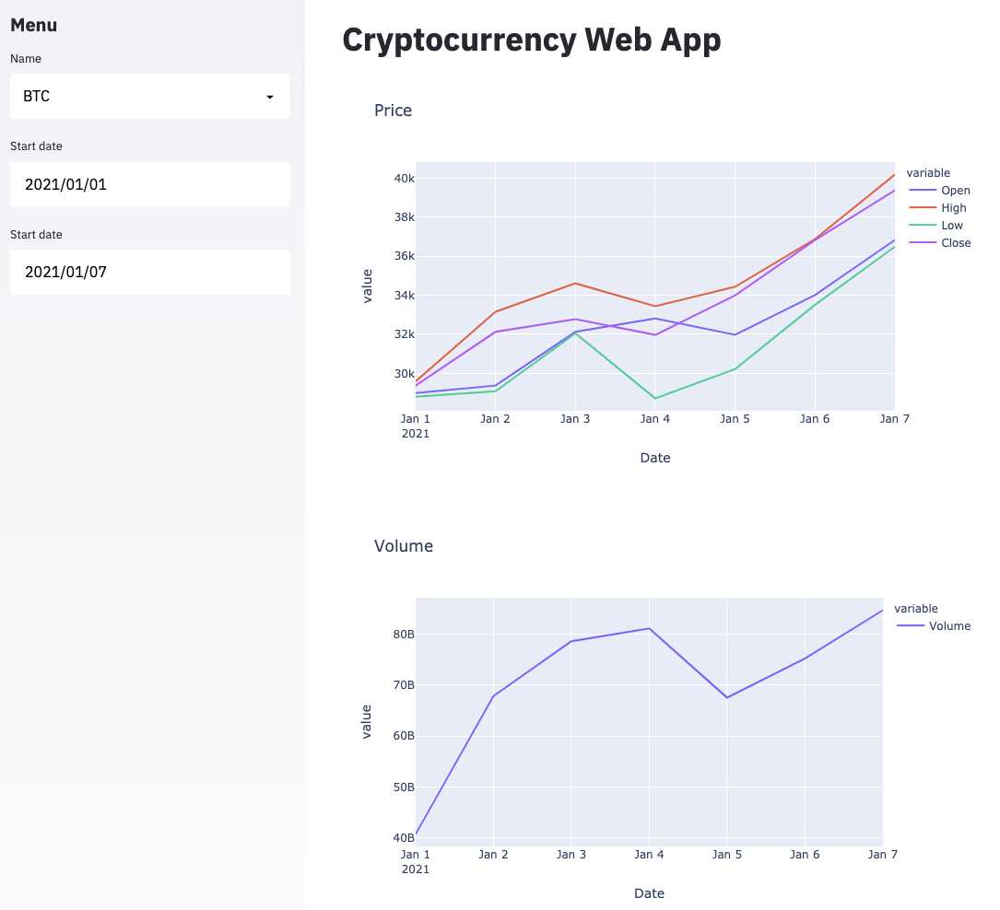

# Streamlit Examples

1. MNIST recognizer web app

2. Cryptocurrency price history web app

## Dependency

- streamlit==0.74.1
- streamlit-drawable-canvas==0.5.1
- cryptocmd==0.6.0
- plotly==4.14.3
- tensorflow==2.4.0
- opencv-python==4.3
- pandas_datareader==0.9.0
